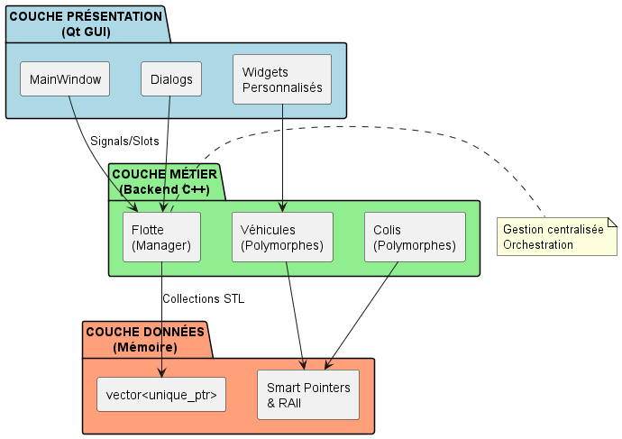
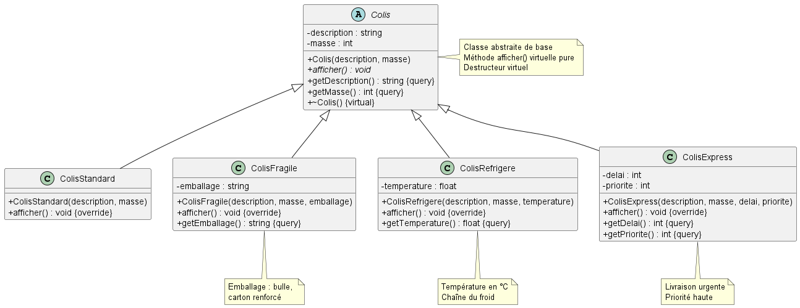

# Système de Gestion de Flotte de Véhicules Autonomes


Application de gestion d'une flotte de véhicules autonomes (drones, camionnettes électriques, robots de trottoir) permettant l'optimisation des livraisons de colis selon leurs caractéristiques (standard, fragile, réfrigéré, express) avec Interface graphique moderne développée avec Qt et backend en C++17.

---

## Table des Matières

1. [Aperçu du Projet](#-aperçu-du-projet)
2. [Technologies](#-technologies)
3. [Architecture du Système](#-architecture-du-système)
4. [Concepts C++ Modernes](#-concepts-c-modernes)
5. [Fonctionnalités](#-fonctionnalités)
6. [Structure des Fichiers](#-structure-des-fichiers)
7. [Guide d'Utilisation](#-guide-dutilisation)
8. [Installation](#-installation)
9. [Compilation](#-compilation)
10. [Gestion des Erreurs](#-gestion-des-erreurs)


---

## Aperçu du Projet

### Objectifs

Le système répond aux besoins suivants :
- **Gestion polymorphe** de différents types de véhicules adaptés aux contraintes urbaines
- **Classification intelligente** des colis selon leurs caractéristiques (fragilité, température, urgence)
- **Optimisation automatique** de l'attribution des colis aux véhicules selon leurs capacités
- **Interface intuitive** permettant un suivi en temps réel de la flotte

### Fonctionnalités Principales

- Création et gestion de 3 types de véhicules autonomes (capacités variables)
- Réception de 4 catégories de colis avec propriétés spécifiques
- Attribution automatique avec validation de compatibilité masse/capacité
- Visualisation en temps réel de l'état de chaque véhicule
- File d'attente intelligente pour les colis en surplus
- Interface graphique Qt moderne avec dialogues personnalisés

---

##  Technologies

### C++17

Le projet exploite les fonctionnalités modernes de C++17 :

| Feature | Utilisation dans le projet |
|---------|----------------------------|
| **Smart Pointers** | `std::unique_ptr` pour la gestion automatique de la mémoire |
| **Move Semantics** | Transferts efficaces d'objets volumineux (colis, véhicules) |
| **Structured Bindings** | Décomposition des paires retournées par les méthodes |
| **Enum Class** | Types énumérés fortement typés (EtatVehicule) |
| **Inline Variables** | Variables constexpr dans les headers |
| **STL Containers** | `std::vector`, `std::queue`, `std::map` pour collections |

### Qt Framework

**Version** : Qt 6.9.2 

| Module | Usage |
|--------|-------|
| **QtCore** | Système de signaux/slots, conteneurs Qt |
| **QtWidgets** | Composants d'interface (QMainWindow, QDialog, QTableWidget) |
| **QtGui** | Gestion des événements, modèles graphiques |
| **UIC** | Compilation automatique des fichiers `.ui` |
| **MOC** | Meta-Object Compiler pour signals/slots |

### Environnement de Développement

- **Compilateur** : g++ 13.2.0
- **Build System** : CMake 3.29.2 (voir `CMakeLists.txt`)
- **IDE** : Qt Creator 17.0.1
- **Standard** : C++17 (`-std=c++17`)

---

## Architecture du Système

### 4.1 Vue d'Ensemble

Le projet suit une architecture en 3 couches garantissant la séparation des responsabilités :

<div align="center">
  
  <br>
  <em>Figure 1 : Architecture en 3 couches</em>
</div>

---

### 4.2 Couche Métier (Backend C++)

<div align="center">
  
  <br>
  <em>Figure 2 : Diagramme des classes complet</em>
</div>

#### Hiérarchie des Colis
<div align="center">
  
  <br>
  <em>Figure 3 : Hiérarchie des Colis</em>
</div>

| Type | Attributs Spécifiques | Particularités |
|------|----------------------|----------------|
| **ColisStandard** | Aucun | Colis de base sans contrainte |
| **ColisFragile** | `emballage` (string) | Nécessite protection spéciale (bulle, carton renforcé) |
| **ColisRefrigere** | `temperature` (float) | Maintien de la chaîne du froid (°C) |
| **ColisExpress** | `delai` (int), `priorite` (int) | Livraison urgente, priorité haute |

---

#### Hiérarchie des Véhicules

<div align="center">
  
  <br>
  <em>Figure 4 : Hiérarchie des Véhicules</em>
</div>

| Type | Capacité Max | Attributs Spécifiques | Usage Recommandé |
|------|--------------|----------------------|------------------|
| **Drone** | 5 kg | `altitude_max`, `autonomie` | Colis légers, zones difficiles d'accès |
| **CamionnetteElectrique** | 500 kg | `autonomie`, `vitesse_max` | Gros volumes, longues distances |
| **RobotTrottoir** | 20 kg | `largeur`, `type_roues` | Livraisons urbaines, trottoirs |

---

#### Classe Flotte

<div align="center">
  
  <br>
  <em>Figure 5 : Classe Flotte</em>
</div>

La classe `Flotte` constitue le **gestionnaire central** du système, coordonnant l'ensemble des véhicules et colis.

**Rôle** :
- Centralisation de toutes les opérations de gestion
- Maintien de collections polymorphes (`vector<unique_ptr<>>`)
- Gestion d'une file d'attente pour colis en surplus
- Application de la logique métier (validations, attributions)

**Méthodes Principales** :

| Méthode | Signature | Description |
|---------|-----------|-------------|
| `ajouterVehicule` | `void(unique_ptr<Vehicule>)` | Ajoute un véhicule à la flotte |
| `recevoirColis` | `bool(unique_ptr<Colis>)` | Reçoit un colis et tente attribution automatique |
| `assignerColis` | `bool(int idColis, int idVehicule)` | Attribution manuelle colis → véhicule |
| `livrerColis` | `int(int idVehicule)` | Vide le véhicule et marque livraisons |
| `afficherFlotte` | `string()` | Génère un rapport détaillé de l'état |
| `getVehicule` | `Vehicule*(int id)` | Accès direct à un véhicule (lecture seule) |
| `getColisEnAttente` | `vector<Colis*>()` | Liste des colis non assignés |
---

### 4.3 Couche Présentation (Qt)
<div align="center">
  
  <br>
  <em>Figure 6 : Diagramme de composants</em>
</div>
#### MainWindow

**Fichiers** : [mainwindow.h](gui/mainwindow.h), [mainwindow.cpp](gui/mainwindow.cpp), [mainwindow.ui](gui/mainwindow.ui)

Fenêtre principale de l'application offrant :
- **Menu principal** : actions globales (Nouveau véhicule, Recevoir colis, Quitter)
- **QTableWidget central** : liste des véhicules avec colonnes (ID, Type, Nom, Charge, Capacité, État)
- **Barre d'outils** : accès rapide aux actions fréquentes
- **Barre de statut** : indicateurs en temps réel (nb véhicules, colis en attente)

#### Dialogues Personnalisés
| Dialogue | Fichiers | Rôle |
|----------|----------|------|
| **DialogCreerVehicule** | `dialogcreervehicule.{h,cpp,ui}` | Formulaire de création : choix du type (combo), nom, paramètres spécifiques (altitude/autonomie/largeur) |
| **DialogCreerColis** | `dialogcreercolis.{h,cpp,ui}` | Formulaire de réception : type de colis, description, masse, attributs spécifiques |
| **DialogDetailsVehicule** | `dialogdetailsvehicule.{h,cpp,ui}` | Vue détaillée d'un véhicule : liste des colis chargés, charge actuelle, bouton "Livrer" |

#### Widgets Personnalisés

- **QTableWidget étendu** : tri personnalisé, formatage conditionnel (couleurs selon charge)
- **QComboBox typé** : listes déroulantes pour types de véhicules/colis
- **Validateurs Qt** : `QDoubleValidator` pour masses, `QIntValidator` pour IDs

#### Diagramme des sequences
<div align="center">
  
  <br>
  <em>Figure 6 : Diagramme de Séquence</em>
</div>
---

## Concepts C++ Modernes utilsés

### 1. Smart Pointers (`std::unique_ptr`)

**Définition** : Pointeur intelligent garantissant la propriété exclusive d'un objet avec libération automatique.

**Utilisation** : Gestion de tous les objets polymorphes (colis, véhicules) pour éviter les fuites mémoire.

---

### 2. Move Semantics

**Définition** : Transfert efficace de ressources d'un objet temporaire vers un nouvel objet sans copie coûteuse.

**Utilisation** : Transferts de colis et véhicules entre fonctions sans duplication de données volumineuses.

**Exemple** :


---

### 3. Polymorphisme & Virtual

**Définition** : Capacité d'invoquer des méthodes spécifiques via une référence/pointeur de base grâce au dispatch dynamique.

**Utilisation** : Collections hétérogènes de colis/véhicules avec comportements spécialisés.


---

### 4. Const Correctness

**Définition** : Utilisation systématique de `const` pour garantir l'immutabilité et clarifier les intentions.

**Utilisation** : Méthodes d'accès en lecture seule, paramètres non modifiés, protection des données.

---

### 5. Interdiction de Copie (`= delete`)

**Définition** : Suppression explicite du constructeur de copie et de l'opérateur d'affectation pour éviter les copies non désirées.

**Utilisation** : Classes gérant des ressources uniques (Flotte, Vehicule, Colis) où la copie n'a pas de sens.

**Exemple** :

```cpp
class Flotte {
public:
    Flotte() = default;
    
    // Interdiction explicite de copie
    Flotte(const Flotte&) = delete;
    Flotte& operator=(const Flotte&) = delete;
    
    // Move autorisé
    Flotte(Flotte&&) noexcept = default;
    Flotte& operator=(Flotte&&) noexcept = default;
};

// Erreur de compilation si tentative de copie :
// Flotte f2 = f1;  // Impossible
// Flotte f3 = std::move(f1);  //OK
```

---

### 6. RAII (Resource Acquisition Is Initialization)

**Définition** : Principe liant la durée de vie d'une ressource à celle d'un objet (allocation au constructeur, libération au destructeur).

**Utilisation** : Gestion automatique de la mémoire via smart pointers, destructeurs garantis même en cas d'exception.

**Exemple** :

```cpp
class GestionnaireFlotte {
private:
    Flotte flotte;  // RAII : construction automatique
    
public:
    void traiterCommandes() {
        auto drone = std::make_unique<Drone>(...);  // Allocation
        flotte.ajouterVehicule(std::move(drone));
        
        if (erreur) {
            throw std::runtime_error("Erreur");  // Exception
        }
        // Même en cas d'exception, les destructeurs sont appelés
    }
};  // Fin du scope : destruction automatique de flotte et ses ressources
```

---

## Fonctionnalités

| Fonctionnalité | Description |
|----------------|-------------|
| **Créer un véhicule** | Ajout d'un drone, camionnette ou robot avec paramètres spécifiques 
| **Recevoir un colis** | Enregistrement d'un nouveau colis avec attribution automatique si possible |
| **Voir détails d'un véhicule** | Affichage complet : colis chargés, charge actuelle, état, caractéristiques | 
| **Livrer les colis** | Vide un véhicule, le rend disponible, tente réaffectation des colis en attente |
| **Consulter file d'attente** | Liste des colis non assignés (capacité insuffisante)
| **Modifier l'état d'un véhicule** | Changement manuel (Disponible/Maintenance/Hors service)

---
##  Guide d'Utilisation
<div align="center">
  
  <br>
  <em>Figure 7 : Interface d'acceuil</em>
</div>

#### 1️⃣ Créer un Véhicule

1. Cliquer sur **Creer Véhicule** dans le menu
2. Choisir le type dans la liste déroulante (Drone / Camionnette / Robot)
3. Remplir les champs :
   - **Nom** : identifiant personnalisé (ex: "Drone Alpha")
   - **Paramètres spécifiques**: autonomie (pour les drones)

4. Cliquer sur **creer**
5. Le véhicule apparaît dans le tableau avec l'état "En service"

<div align="center">
  
  <br>
  <em>Figure 7 : Interface d'acceuil</em>
</div>

---

#### 2️⃣ Creer un Colis

1. Cliquer sur **Créer Colis** (ou Ctrl+R)
2. Sélectionner le type de colis :
   - Standard, Fragile, Réfrigéré, ou Express
3. Remplir les informations :
   - **Description** : contenu du colis
   - **Masse** : poids en kg (validation automatique)
   - **Attributs spécifiques** :
     - Réfrigéré : température requise (°C)
     - Fragilité : faible, Moyen, Elevé
4. Cliquer sur **Creer**

<div align="center">
  
  <br>
  <em>Figure 8 : Créer un Colis</em>
</div>
---

#### 3️⃣ Consulter les Détails d'un Véhicule

1. **Double-cliquer** sur une ligne du tableau principal
2. Une fenêtre s'ouvre avec :
   - Informations générales (type, nom, capacité)
   - Charge actuelle / Capacité maximale (barre de progression)
   - Liste détaillée des colis chargés (description, masse)
   - État du véhicule (indicateur coloré)
3. Possibilité de livrer directement depuis cette fenêtre

<div align="center">
  
  <br>
  <em>Figure 9 : les Détails d'un Véhicule</em>
</div>

---

#### 4️⃣ Assigner un Colis a un vehicule

1. Selectionner un vehicule
2. Secetionner un colis
3. Cliquer sur "Assigner"
4. La barre d'état se met à jour (La charge varie ainsi que le nb des colis)

<div align="center">
  
  <br>
  <em>Figure 9: Assigner un Colis a un vehicule</em>
</div>


---

#### 5️⃣ Livrer un / Les colis 
1. Selectionner un vehicule
2. Cliquer sur "Livrer"
3. Cliquer sur "Confirmer la livraison"
4. La barre d'état du vehicule selectionné se met à nouveau ( le nb des colis devient 0)

<div align="center">
  
  <br>
  <em>Figure 9: Livrer  Les colis </em>
</div>

#### 6️⃣ Supprimer un vehicule
1. Selectionner un vehicule
2. Cliquer sur "Supprimer"
3. Cliquer sur "Confirmer la suppression"

<div align="center">
  
  <br>
  <em>Figure 9: Supprimer un vehicule </em>
</div>

---


##  Gestion des Erreurs

Le système implémente une validation robuste à plusieurs niveaux garantissant la cohérence des données et la sécurité des opérations.

### Validations des Entrées Utilisateur

| Validation | Règle | Message d'Erreur |
|------------|-------|------------------|
| **Nom véhicule/Description colis** | Non vide, 3-50 caractères | "Le nom doit contenir entre 3 et 50 caractères" |
| **Masse du colis** | > 0.00 kg, format décimal | "La masse doit être positive (min: 0.10kg)" |
| **Autonomie du drone** | > 0 km, valeur entière | "L'autonomie doit être positive" |
| **Capacité du véhicule** | > 0 kg |  "La capacité maximale doit être positive" |

<div align="center">
  
  <br>
  <em>Figure 10 : Contrôle à la saisie avec validateurs Qt</em>
</div>


### Validations de Capacité

```
┌─────────────────────────────────────────────┐
│  Tentative de Chargement                    │
│                                             │
│  Charge actuelle + Masse colis ≤ Capacité?  │
│                                             │
│  OUI ──────────────────────► Chargement     │
│                                             │
│  NON ──► "Capacité insuffisante"            │
│          "Charge: 18kg / Capacité: 20kg"    │
│          "Impossible d'ajouter 5kg"         │
└─────────────────────────────────────────────┘
```

<div align="center">
  
  <br>
  <em>Figure 11 : Validation de la capacité avec détails (utilisée/requise/manquante)</em>
</div>

**Messages détaillés de capacité** :
```
ERREUR : Capacite insuffisante !
  Capacite utilisee : 18000g
  Masse du colis    : 5000g
  Capacite max      : 20000g
  Manquant          : 3000g (3 kg)
```

### Validations des États et Opérations

| Situation | Validation | Comportement |
|-----------|------------|--------------|
| **Livraison impossible** | Véhicule sans colis |  "Aucun colis à livrer" |
| **Suppression impossible** | Véhicule avec ≥1 colis | "Véhicule actuellement en mission" |
| **Retrait colis impossible** | Véhicule vide |  "Aucun colis à retirer (véhicule vide)" |
| **Index invalide** | Index ≥ taille collection |  "Index de véhicule/colis invalide" |
| **Hiérarchie des Messages

Le système utilise des **QMessageBox** avec icônes pour clarifier la gravité :

| Type | Usage | Icône | Exemples |
|------|-------|-------|----------|
| **Critical** | Erreurs bloquantes | 🔴 | Capacité dépassée, index invalide, nullptr |
| **Warning** | Avertissements | ⚠️ | Flotte vide, véhicule sans colis, opération risquée |
| **Information** | Succès et confirmations | ℹ️ | Colis livré, véhicule ajouté, opération réussie |
| **Question** | Demandes de confirmation | ❓ | Supprimer véhicule, livrer colis, quitter application |

### Mécanismes de Protection

1. **Validation en cascade** : Entrée utilisateur → Logique métier → Base de données
2. **Exceptions typées** : `std::invalid_argument` pour arguments invalides
3. **Retours booléens** : `true` si succès, `false` si échec avec message explicite
4. **Smart pointers** : Empêche les fuites mémoire et accès invalides
5. **Const correctness** : Protège contre les modifications accidentelles


### Messages d'Erreur

Le système utilise des icônes QMessageBox pour clarifier la gravité :

- **Critique** : erreurs bloquantes (capacité dépassée)
- **Warning** : avertissements (file d'attente pleine)
- ℹ**Information** : messages de succès (colis livré)
- **Question** : confirmations (supprimer véhicule ?)
---


## Installation

### Prérequis

| Composant | Version Minimale | Commande de Vérification |
|-----------|------------------|--------------------------|
| **C++ Compiler** | g++ 13.2.0 | `g++ --version` |
| **CMake** | 3.29.2 | `cmake --version` |
| **Qt Framework** | 6.9.x | `qmake --version` |
| **Git** | 2.48.x | `git --version` |

### Installation sous Windows

```powershell
# 1. Installer Qt via l'installateur officiel
# Télécharger depuis : https://www.qt.io/download-qt-installer

# 2. Cloner le projet
git clone https://github.com/MeksiSyrine/Gestion_Flotte_v-hicules.git
cd projet_livraison

# 3. Configurer avec CMake
mkdir build
cd build
cmake .. -G "MinGW Makefiles"

# 4. Compiler
cmake --build .
```

### Installation sous Linux (Ubuntu/Debian)

```bash
# 1. Installer les dépendances
sudo apt update
sudo apt install build-essential cmake qt6-base-dev qt6-tools-dev

# 2. Cloner et compiler
git clone https://github.com/MeksiSyrine/Gestion_Flotte_v-hicules.git
cd projet_livraison
mkdir build && cd build
cmake ..
make -j$(nproc)
```

## Compilation

### Avec CMake

```bash
# Configuration
cmake -S . -B build -DCMAKE_BUILD_TYPE=Release

# Compilation
cmake --build build --config Release

# Exécution
./build/flotte_qt  # Linux/macOS
./build/Release/flotte_qt.exe  # Windows
```

### Avec Qt Creator

1. Ouvrir `CMakeLists.txt` dans Qt Creator
2. Configurer le kit (compilateur + Qt version)
3. Cliquer sur **Build → Build Project** (Ctrl+B)
4. Lancer avec **Debug → Start Debugging** (F5)

### Options de Compilation

| Option CMake | Description | Valeur par Défaut |
|--------------|-------------|-------------------|
| `CMAKE_BUILD_TYPE` | Type de build (Debug/Release) | Debug |
| `CMAKE_PREFIX_PATH` | Chemin vers Qt | Auto-détecté |
| `BUILD_TESTS` | Compiler les tests unitaires | OFF |
---


---

<div align="center">

Made with ❤️ using Modern C++17 & Qt

[⬆ Retour en haut](#-système-de-gestion-de-flotte-de-véhicules-autonomes)

</div>
